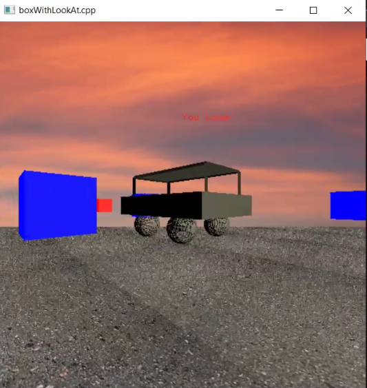
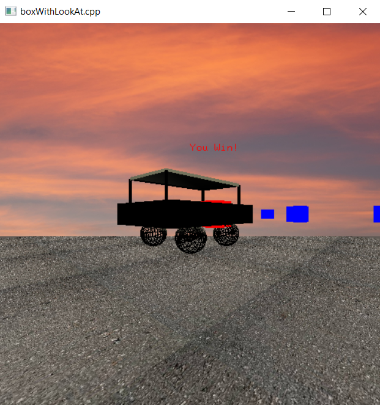

# Car Driving Game

## Project Overview

This project is a simple interactive game where the user controls a car to navigate around obstacles and reach the target. The game features user-friendly controls, collision detection with obstacles, win/lose scenarios, and additional enhancements like texture and realistic lighting effects.

## Scenario

- **User Controls**: Utilize up, down, right, and left keys to drive the car in various directions. The car and camera move together for a seamless gaming experience.

- **Obstacles**: Four randomly distributed cubes serve as obstacles. Colliding with an obstacle stops the car, displaying a 'You Lose !' message for 3 seconds before resetting the game to the initial state.

- **Target**: If the car reaches the target, it stops, and a 'You Win !' message appears for 3 seconds. The game resets to the initial state for the user to start over.

## Texture

- **Ground and Sky Texture**: Enhance the visual experience by adding textures to the ground and sky. 

## Lighting

### Lighting 1

- **Directional Light (Sunlight at Sunset)**:a directional light source to simulate sunset lighting.

### Lighting 2

- **Car Headlights**: two spotlights representing car headlights at the front of the car.
## Dependencies

1. freeglut.
2. GLEW.
3. GLM.

## Installation
To install and run the game, follow these steps:

1. **Clone the Repository**

2. **Install Dependencies**

3. **Install Visual Studio**

4. **unzip the project folder**

5. **Open Visual Studio, then open the solution file (.sln) located in the project folder.**
